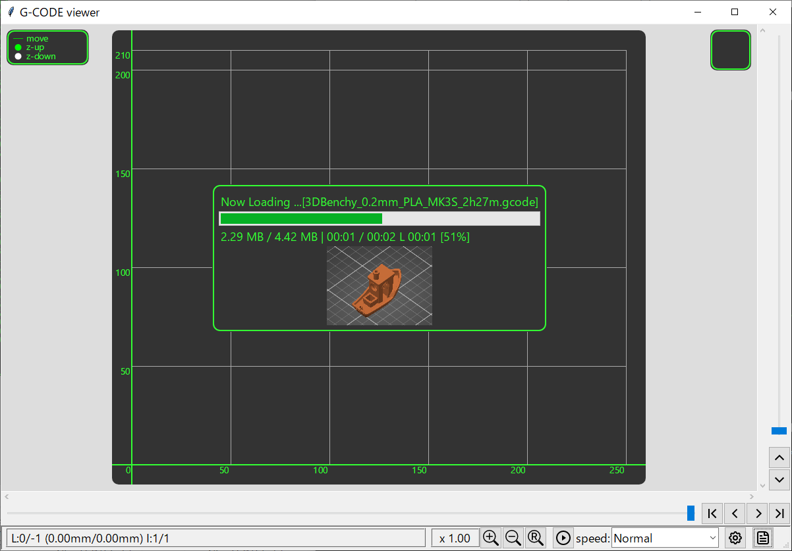
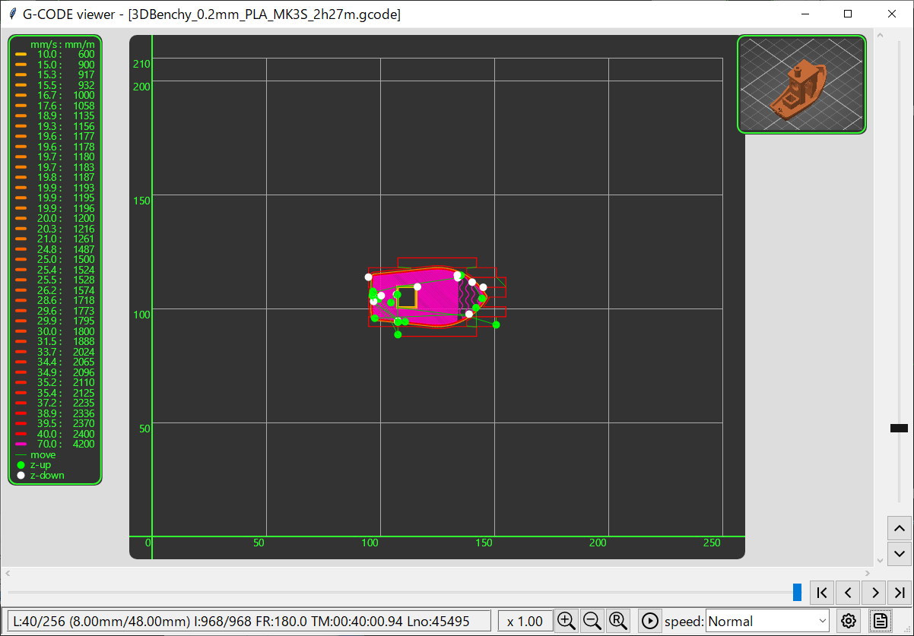
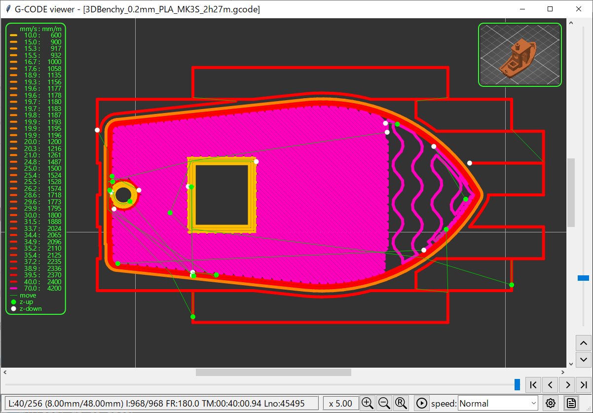

# G-CODE-viewer

## Requirement

numpy skia-python tkinterdnd2 Pillow

## Install & run

for example Windows PowerShell

```
$ mkdir tmp
$ cd tmp
$ py -mvenv venv
$ venv\Scripts\activate.ps1
$ pip install numpy skia-python tkinterdnd2 Pillow
$ wget https://raw.githubusercontent.com/zuntan/G-CODE-viewer/refs/heads/main/g_code_viewer.py -OutFile g_code_viewer.py
$ wget https://raw.githubusercontent.com/zuntan/G-CODE-viewer/refs/heads/main/3DBenchy_0.2mm_PLA_MK3S_2h27m.gcode -Outfile 3DBenchy_0.2mm_PLA_MK3S_2h27m.gcode
$ python g_code_viewer.py
```

- Click `<Paper Icon>` at the bottom right
- Select 3DBenchy_0.2mm_PLA_MK3S_2h27m.gcode
  - loading  3DBenchy_0.2mm_PLA_MK3S_2h27m.gcode
- Click `<Play Icon>` -> Start Animation
  - Chenge speed: `[VeryFirst v]`
  - You can zoom in with the mouse wheel

## Screen Shot




